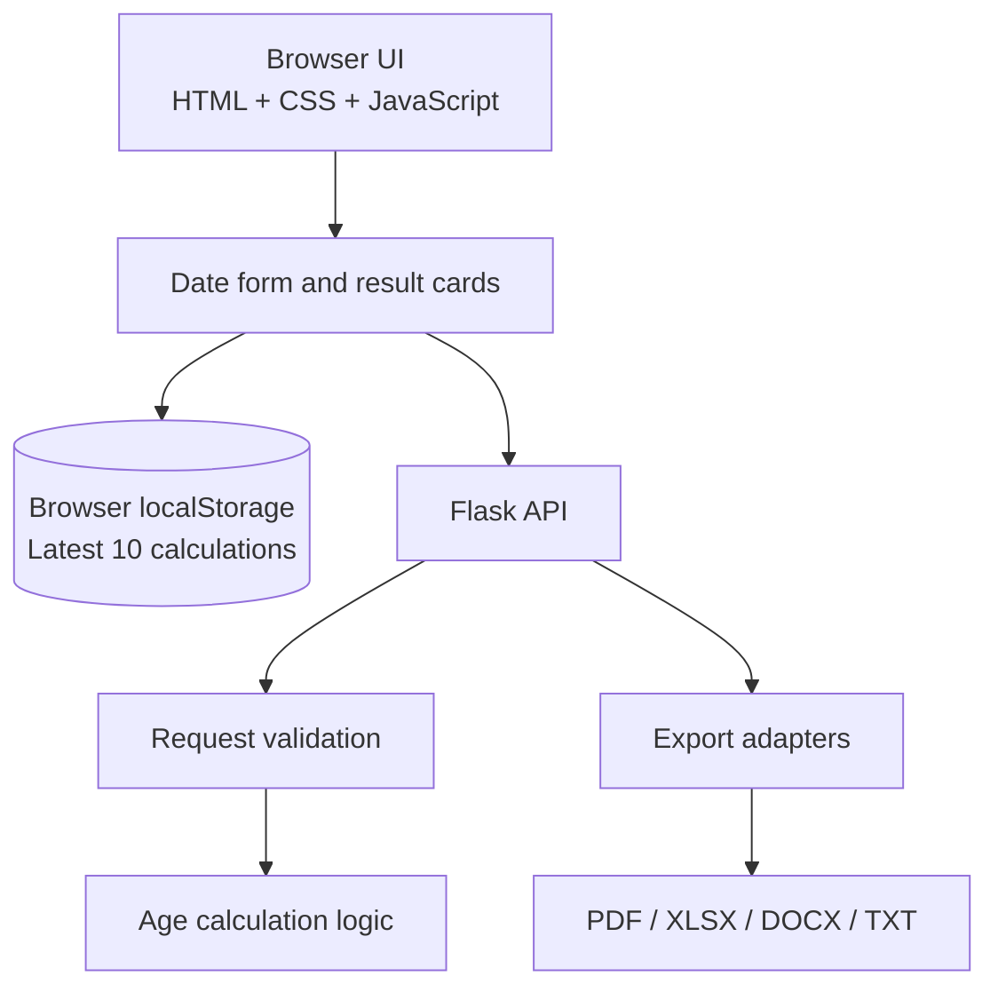
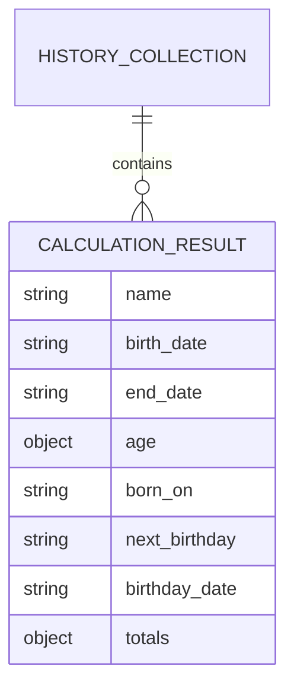

# Architecture

## Overview

The application uses a small client-server architecture. The browser owns interaction state and local history. Flask owns date parsing, age calculation, request validation, and report generation.

## Responsibilities

| Layer | Responsibility |
|---|---|
| `templates/index.html` | Page structure, form controls, result and history regions |
| `static/style.css` | Visual design and responsive layout |
| `static/app.js` | Input formatting, browser validation, API calls, history, downloads |
| `app.py` | Flask routes, validation, age calculation, report generation |
| `tests/test_app.py` | Regression tests for API and calculation behavior |

## Data flow

1. The user enters `dd/mm/yyyy` values in the browser.
2. JavaScript validates and converts them to ISO dates for the API.
3. Flask validates the JSON payload and parses Python `date` values.
4. The calculation function returns age components, totals, and birthday details.
5. The browser renders the result and stores a copy in local storage.
6. Export requests create a report in the selected format and return it as a download.

## Storage design

The project does not use a relational database. History is stored as a JSON array under the browser key `age-calculator-history`, with a maximum of ten result objects.

This browser-local design is intentional for a single-user calculator. It avoids collecting personal dates on a server, but it does not provide cross-device synchronization.
