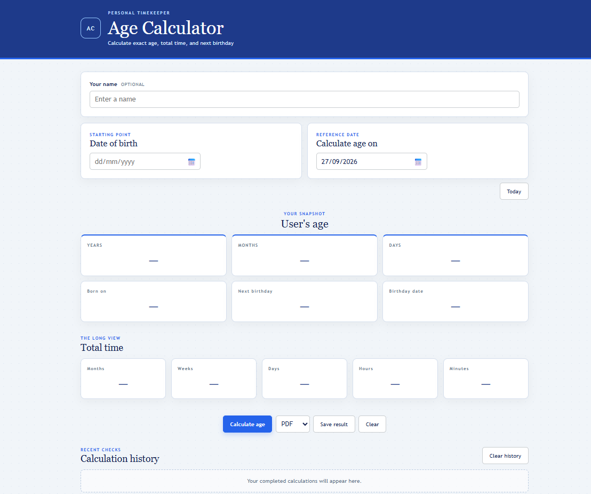
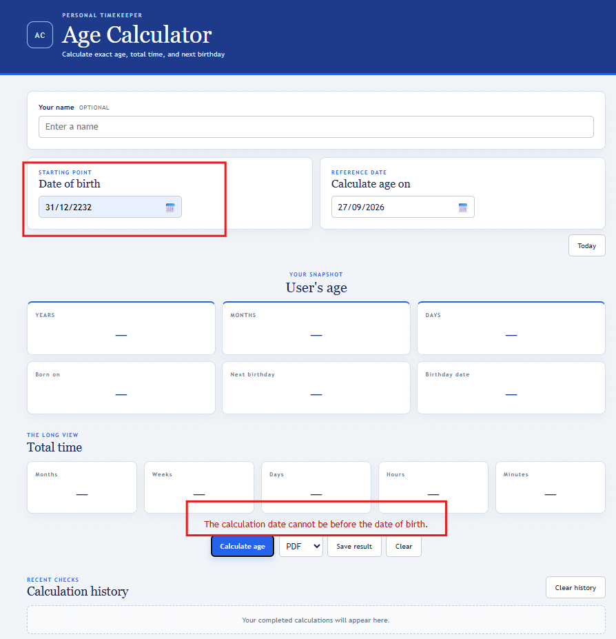
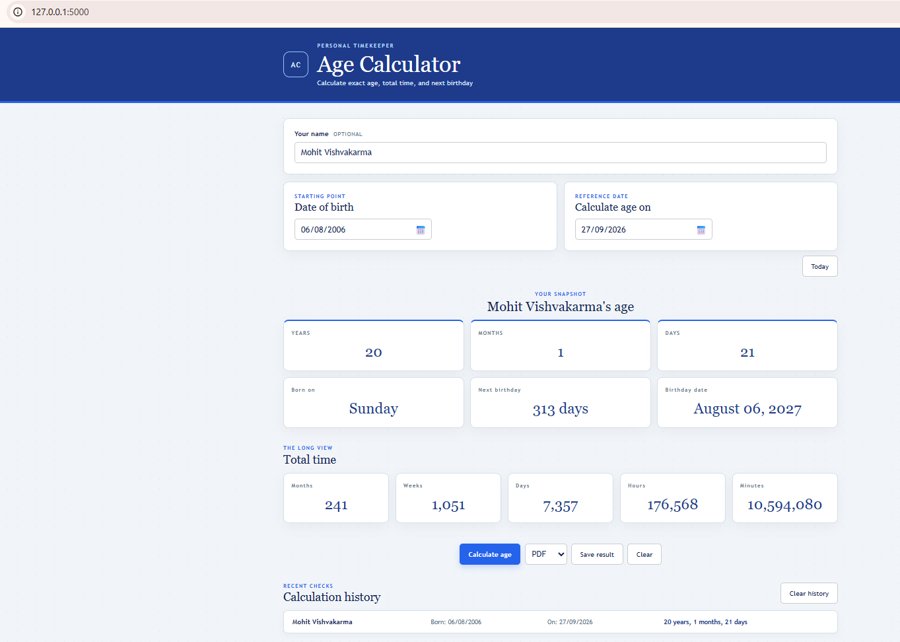
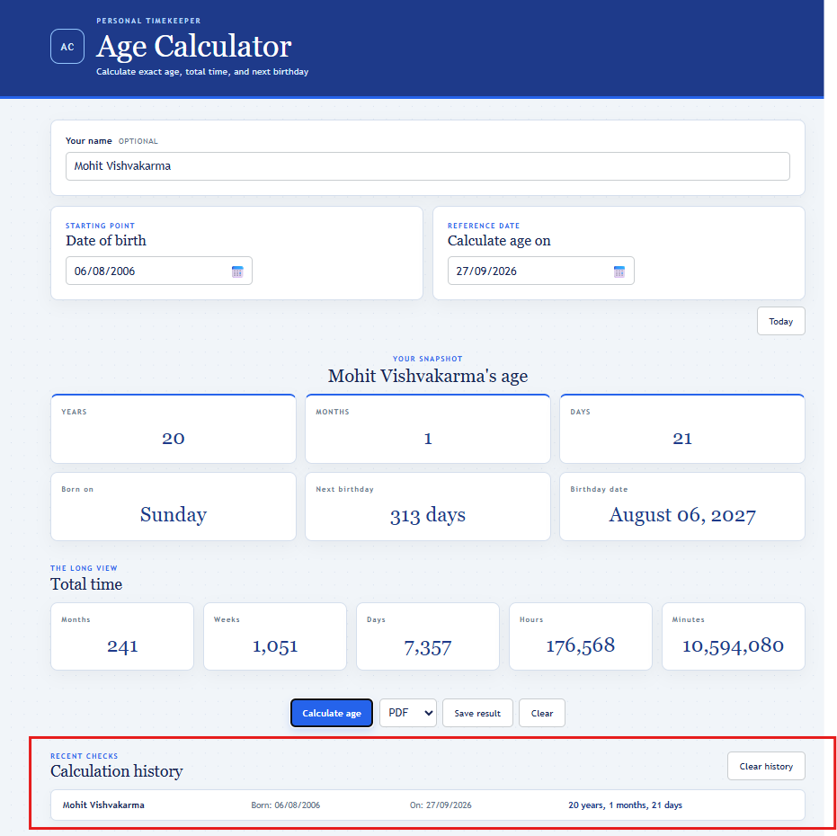
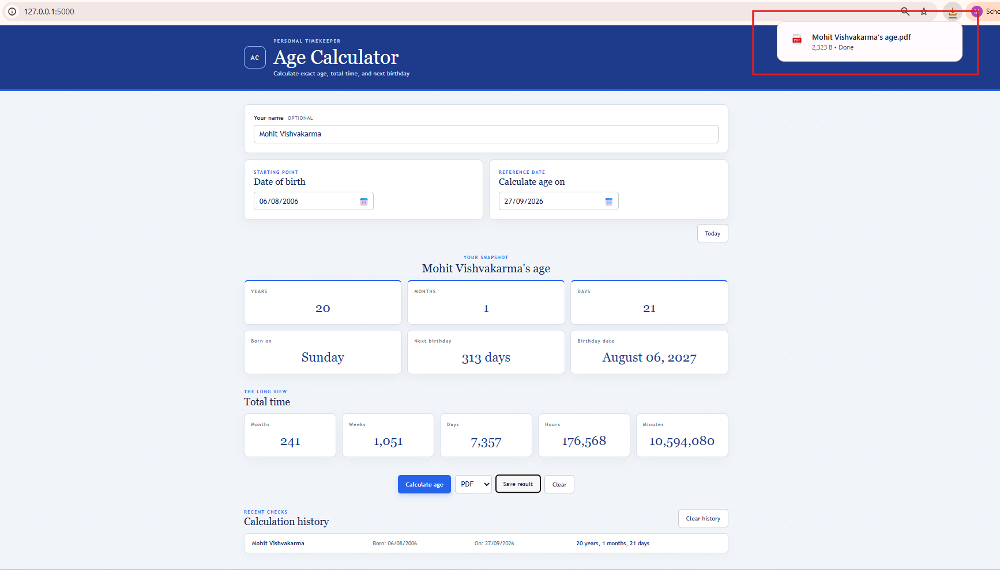
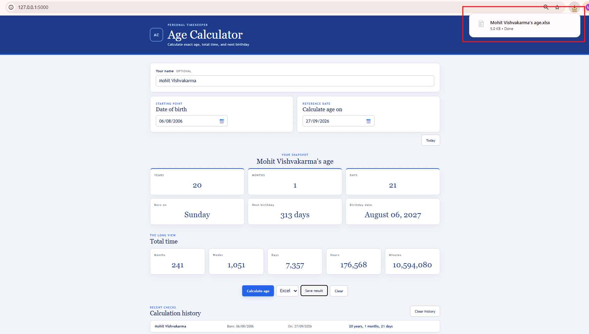
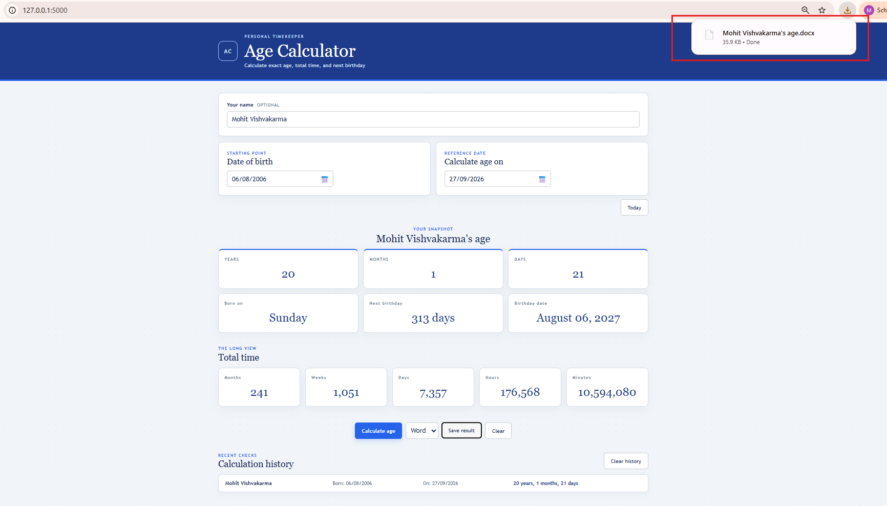
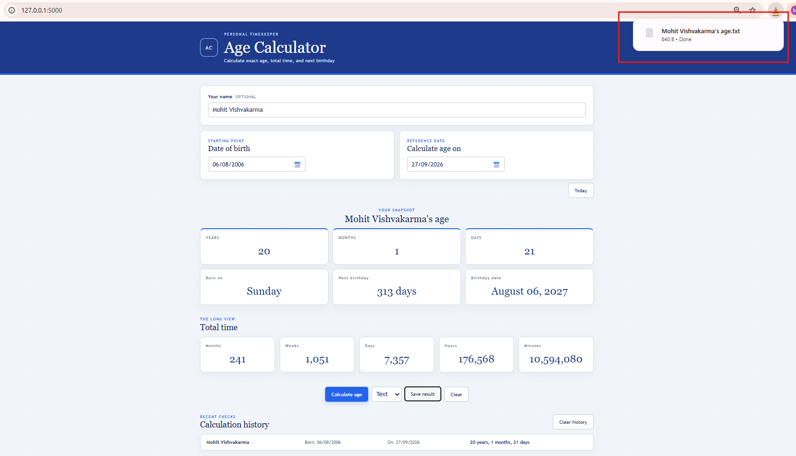

# Project Report: Age Calculator Web Application

## Cover Page

**Project:** Age Calculator Web Application  
**Course:** AIML 
**Student:** Mohit Vishvakarma  
**Enrollment number:** 26MIM10196
**Submission date:** 29/09/2026

## 1. Introduction

Age Calculator is a Flask-based web application that calculates a person's exact age at a selected reference date. It provides a clear browser workflow, server-side validation, local history, and downloadable reports in four formats.

## 2. Problem Statement

Manual age subtraction is error-prone because calendar months have different lengths and leap years change the number of days in February. Users need a reliable way to calculate age, inspect related birthday information, review previous calculations, and save a readable result.

## 3. Objectives

- Accept dates in the user-friendly `dd/mm/yyyy` format.
- Calculate years, months, days, and elapsed-time totals.
- Predict the user's broad age group using a supervised AIML model.
- Handle month lengths and February 29 birthdays consistently.
- Provide clear validation for invalid or incomplete input.
- Allow recent results to be restored from browser history.
- Export a named report in PDF, Excel, Word, or text format.

## 4. Functional Requirements

| ID | Requirement | Implementation |
|---|---|---|
| FR-01 | Enter name and dates | Browser form in `index.html` |
| FR-02 | Validate dates | JavaScript validation and Flask request validation |
| FR-03 | Calculate exact age | `calculate()` in `app.py` |
| FR-04 | Display totals and birthday data | Result cards populated by `app.js` |
| FR-05 | Store and restore recent calculations | Browser `localStorage` |
| FR-06 | Export reports | PDF, XLSX, DOCX, and TXT adapters |
| FR-07 | Predict age group | Trained 1-nearest-neighbor classifier |

The four major functional modules are calculation, AIML prediction, history, and reporting/export.

## 5. Non-Functional Requirements

- **Usability:** Dates are displayed as `dd/mm/yyyy`, support a calendar picker, and show readable validation messages.
- **Reliability:** Validation exists in both the browser and API, with automated regression tests.
- **Maintainability:** Frontend, backend, tests, and documentation are separated into clear files.
- **Security:** User-entered history values are rendered as text, filenames remove unsafe Windows characters, and malformed requests are rejected.
- **Performance:** Calculations are in-memory and complete in constant time for normal date inputs.
- **Privacy:** History remains in browser localStorage and is not persisted on the server.
- **Resource efficiency:** The classifier uses one numeric feature and a small in-memory training set.

## 6. System Architecture

The browser contains the user interface and local history. Flask exposes `/api/calculate` and `/api/export`. The server validates requests, runs date logic, and creates report files. See [architecture.md](architecture.md).

## 7. Design Diagrams

The repository includes the required diagrams in [uml.md](uml.md), [workflow.md](workflow.md), and [architecture.md](architecture.md):

- Use-case diagram
- Component/class diagram
- Sequence diagram
- Workflow diagram
- System architecture diagram
- LocalStorage schema diagram

## 8. Design Decisions and Rationale

- **Flask:** Small routing surface and direct integration with Python date logic.
- **Browser localStorage:** Keeps personal history local without requiring accounts or a database.
- **Server-side validation:** Prevents clients from bypassing date and export checks.
- **On-demand export imports:** Export libraries are imported only when the selected format requires them.
- **Standard-library unittest:** Keeps the test suite easy to run without adding a testing framework dependency.
- **Report tables:** Tables make PDF and text exports easier to scan than unstructured lines.
- **Transparent AIML model:** A 1-nearest-neighbor classifier makes the age-group decision easy to explain and audit.
- **Version control:** Git is used to track source-code, tests, UI, and documentation changes in the project repository.

## 8.1 AIML Dataset, Model, and Evaluation

The classifier uses a synthetic labeled dataset of integer ages from 0 through 120. Labels are assigned using the project domain definition: 0-12 Child, 13-19 Teenager, 20-59 Adult, and 60 or older Senior. No personal data is used for training.

The selected model is a 1-nearest-neighbor classifier with age as its single feature. This model is appropriate because age-group boundaries are ordered, deterministic, and easy to interpret. The model is trained in memory when the application starts.

Evaluation uses boundary examples and API tests: ages 12, 13, 19, 20, 59, and 60 must map to the correct class. The test suite also verifies the Adult prediction for the sample calculation and ensures the prediction is included in exports.

## 9. Implementation Details

The browser normalizes typed dates and converts them to ISO format before sending JSON. Flask parses the ISO dates, computes calendar-aware age values, predicts the age group, formats output dates, and returns JSON. Export requests are validated before report generation. The latest ten successful results are stored under `age-calculator-history`.

## 10. Screenshots and Results

The running interface contains date inputs, age cards, total-time cards, action controls, and clickable history rows. A typical result includes:

| Result | Example |
|---|---|
| Age | 24 years, 10 months, 19 days |
| AI age group | Adult |
| Total days | 9,089 |
| Total hours | 218,136 |
| Total minutes | 13,088,160 |
| Report filename | `Ankit's age.pdf` |

### Main calculator interface



### Validation and calculation result





### Calculation history



### Exported reports









## 11. Testing Approach

The project uses Python `unittest` with Flask's test client. The ten tests cover normal calculation, age-group boundary predictions, leap-day birthdays, invalid JSON, invalid dates, reversed dates, text-table output, named filenames, incomplete export data, unsupported formats, and non-numeric export values.

Run:

```bash
python -m unittest discover -s tests -v
```

Latest verification: **10 tests passed**.

## 12. Challenges Faced

- Handling different month lengths without producing negative day values.
- Defining a consistent February 29 birthday rule in non-leap years.
- Keeping the browser's `dd/mm/yyyy` display separate from the API's ISO format.
- Producing readable table layouts across PDF and plain-text exports.
- Keeping filenames useful while removing characters invalid on Windows.
- Selecting an AIML approach that is explainable and small enough to run without a model service.

## 13. Learnings and Key Takeaways

- Client-side validation improves usability, but server-side validation is still required for correctness.
- Date calculations need explicit rules for leap years and month boundaries.
- A small application benefits from separate UI, API, calculation, export, test, and documentation responsibilities.
- Automated tests expose edge cases that normal examples do not reveal.
- Simple supervised models can add useful domain classification without collecting a personal dataset.

## 14. Future Enhancements

- Add optional database-backed, cross-device history.
- Add localization for date formats and interface language.
- Add browser end-to-end tests and automated screenshot capture.
- Add report preview and configurable report templates.
- Add user accounts only if cloud history becomes necessary.
- Expand the age-group model with additional features only when a suitable consented dataset is available.

## 15. References

- Python `datetime` and `calendar` standard-library documentation.
- Flask documentation for routing, JSON requests, and test clients.
- ReportLab documentation for PDF tables.
- openpyxl documentation for workbook creation.
- python-docx documentation for Word document creation.
- Mermaid documentation for Markdown diagrams.
