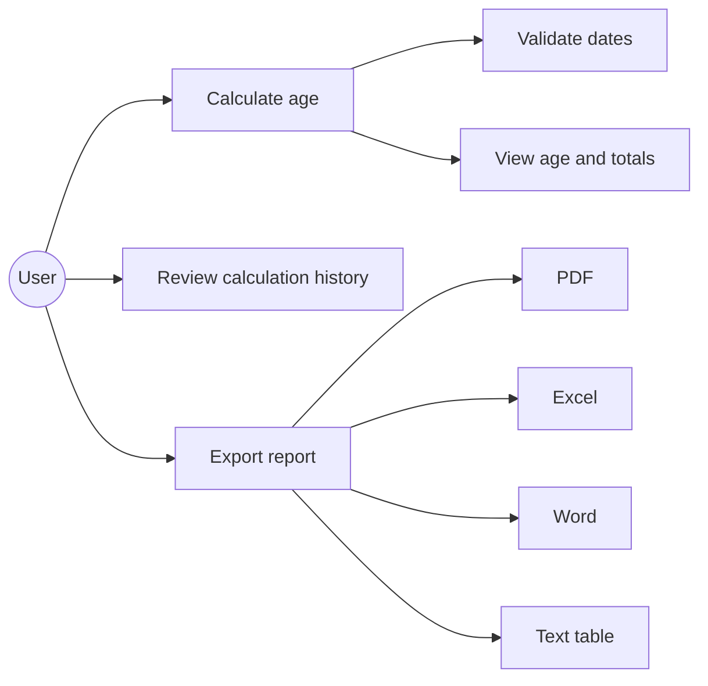
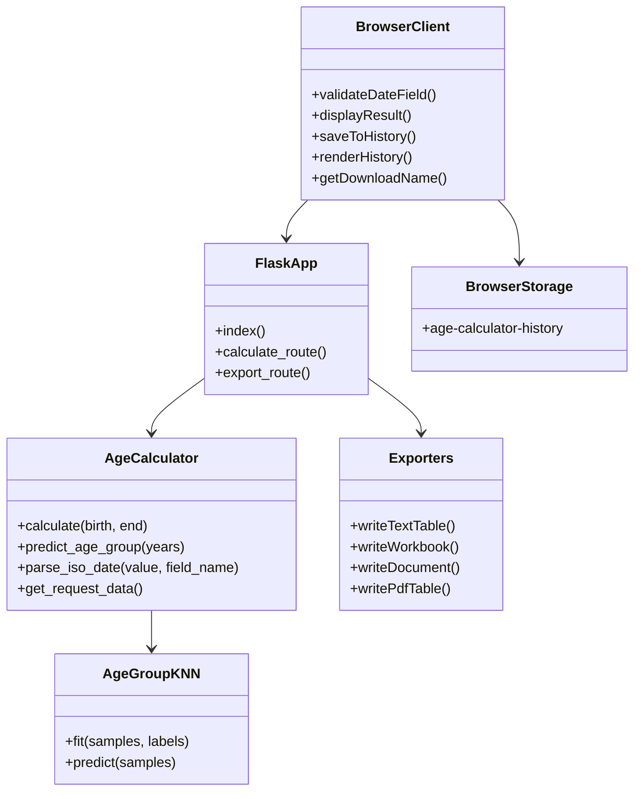
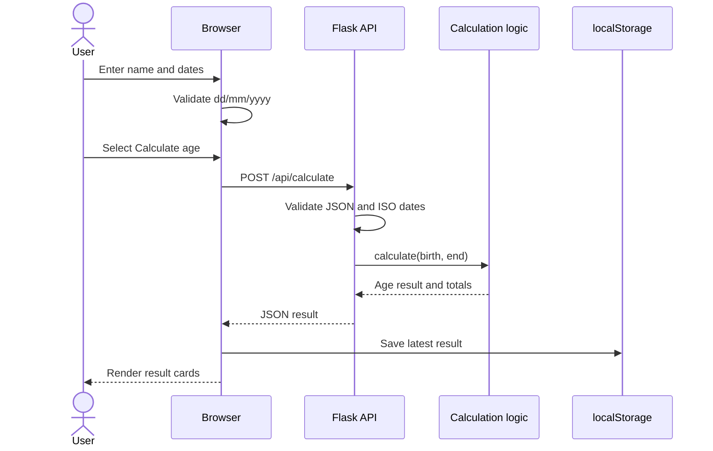

# UML Diagrams

The diagrams use Mermaid and can be rendered by Markdown viewers that support Mermaid.

## Use-case diagram

## Class and component view

## Sequence diagram: calculate and save history

