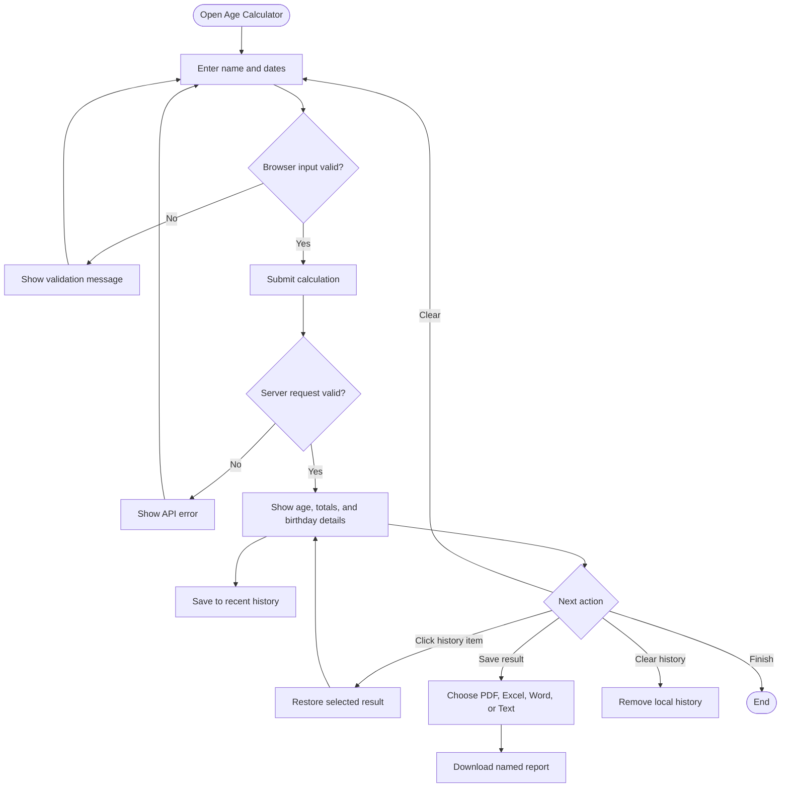

# User Workflow

## Error paths

- Empty or malformed dates are rejected in the browser.
- Impossible calendar dates are rejected before submission.
- Missing or invalid JSON receives HTTP 400 from Flask.
- A calculation date before the birth date receives HTTP 400.
- Incomplete export data receives HTTP 400.
- Unsupported export formats receive HTTP 400.
